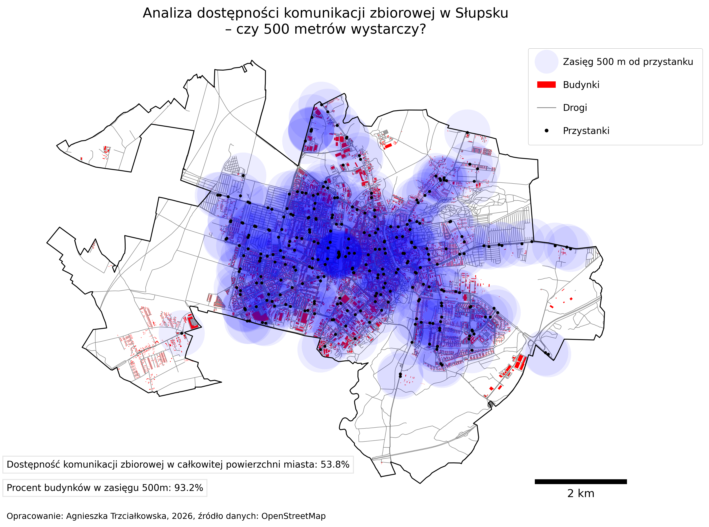

# Spatial_Analysis
Spatial analysis of public transport accessibility in Słupsk, conducted using Python (GeoPandas) and OpenStreetMap data. The project examines 500m buffer zones around bus stops within the city's current administrative boundaries.


# Public Transport Accessibility Analysis in Słupsk

**Author: Agnieszka Trzciałkowska (based on OSM maps)**

This project contains an original spatial analysis of public transport accessibility within the city of Słupsk.

## Objective
The goal of this analysis was to determine what percentage of the city's area and residential buildings are located within a 500-meter radius of bus stops. The map takes into account the current administrative boundaries of Słupsk, including areas incorporated in 2026 (Bolesławice).

## Technologies
* **Python**: `geopandas` for geospatial analysis, `matplotlib` for visualization.
* **QGIS**: used for attribute table editing and removing unnecessary layers (municipality and district boundaries), saved in GeoJSON format.
* **Data**: OpenStreetMap.
* **Coordinate Reference System (CRS)**: EPSG:2180.

## Results
The map and calculations indicate that:
- **53.8%** of the total city area is within a 500m reach of a bus stop.
- **93.2%** of buildings have access to public transport (within a 500m radius).
- Areas recently incorporated into the city limits show a significant deficit in public transport accessibility.



## How to run the project?
1. Make sure you have the required libraries installed:
   ```bash
   pip install geopandas matplotlib matplotlib-scalebar
